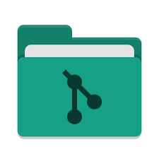

# DokuPository 
> Verwalte deine Dokumentationen  
> Verbinde die Dokumentationseinträge mit Commits (GOGS)  
> Generiere Benutzerdokumentationen und Changelogs anhand der Versionen
  


## TOC
- [System Anforderungen](#system-anforderungen)
- [DokuPository konfigurieren, builden und starten](#dokupository-konfigurieren-builden-und-starten)
- [Funktionen von DokuPository](#funktionen-von-dokupository)
    - [Menu](#menu)
    - [Filter](#filter)
- [FAQ](#faq)
    - [Repository Konfiguration](#repository-konfiguration)
    - [Datenbank Konfiguration](#datenbank-konfiguration)
        - [MySQL mit Docker (Bitnami)](#mysql-mit-docker-von-bitnami)
        - [MySQL Backup and Dumps](#mysql-backup-and-dumps)
    - [Logging](#logging)
    - [Doku Vorlage](#doku-vorlage)
        - [Doku Vorlage erstellen](#doku-vorlage-erstellen)
        - [Doku Vorlage anpassen](#doku-vorlage-anpassen)  
   

## System Anforderungen
- Apache Maven
- JDK 11
- GOGS als Repository `docker run -p 3000:3000 gogs/gogs`

## DokuPository konfigurieren, builden und starten

### Konfiguration
Die Datenbank sowie Loglevels usw können in der Datei `src/main/resources/application.properties` angepasst bearbeitet werde, siehe unter **FAQ**.

### Applikation builden vom Quellcode (JAVA_HOME=java11)
`mvn clean install`

### Applikation starten vom Quellcode (JAVA_HOME=java11)
`mvn clean javafx:run`

### Applikation starten (als .jar mit JRE 11)
Normal (DE)  
`java -jar target/DokuPository-1.0.jar`  
Normal (FR)  
`java -Duser.language=fr -jar target/DokuPository-1.0.jar`  
Linux mit GTK 2   
`java -Djdk.gtk.version=2 -jar target/DokuPository-1.0.jar`

> Sollte nicht genug RAM zur Verfügung stehen, kann mittels des Parameters `lazy-controller-initialisation=true` ein OOM beim Starten der Applikcation vorgebeugt werden

`java -Dlazy-controller-initialisation=true -jar target/DokuPository-1.0.jar`  

## Funktionen von DokuPository

### Menu

- **Dokumentationen Verwalten**
  - Erfassen von Text
  - Verbinden mit Versionen (Start, End)
  - Verbinden von Bilder
  - Verbinden von Commits

- **Dokumentationen generieren**
  - Changelog (anhand von und bis der Versionen)
  - Benutzerdokumentation (anhand der Endversion)

- **Stammdaten**
  - Applikation
  - Version
  - Ignorierte commits
  - Doku Vorlage
  - Benutzer

### Filter
> Beim Filtern wird die `toString()` Methode der jeweiligen `ch.bytecrowd.dokupository.gui.models.ViewModel*` mit dem Filterwert verglichen.  
Dies bietet den Vorteil, dass spezifischer gesucht werden kann, vorallem beim Erfassen oder Nachtragen von Dokueinträgen.
So kann z.B. nach allen einträgen gesucht werden in denen der französische Text noch fehlt `textFr=null`  
Folgende Suchschlüssel können verwendet werden:

**Filter im Menupunkt: Dokumentationen Verwalten**

- Doku Einträge
    - `id=`
    - `textDe=`
    - `textFr=`
    - `style=`    
    - `docType=`
    - `versionBegin=`
    - `versionEnd=`
    - `missingDe=true` → zeigt wenn `textDe` null oder empty ist oder weniger DE als FR Printscreens vorhanden sind
    - `missingFr=true` → zeigt wenn `textFr` null oder empty ist oder weniger FR als DE Printscreens vorhanden sind

- Printscreens
    - `id=`
    - `footnote=`
    - `lang=`    

**Filter im Menupunkt: Stammdaten**
- Applikation
    - `id=`
    - `appType=`
    - `nameDe=`
    - `nameFr=`
    - `nameFr=`
    - `responsible=Vorname Nachname (Username)`
- Version
    - `id=`
    - `version=`
    - `app=`
    - `state=`
- Ignorierte commits
    - `id=`
    - `hash=`
    - `app=`
- Doku Vorlage
    - `id=`
    - `name=`
    - `docType=`
    - `lang=`
- Benutzer
    - `id=`
    - `firstName=`
    - `lastName=`
    - `username=`
    - `acronym=`

## FAQ

### Repository Konfiguration
- URL:   
    `http://host/api/v1/repos/:owner/:repo` z.B. `http://localhost:3000/api/v1/repos/roy/dummy-repo`
- Token:  
    kann im Gogs UI generiert werden `Your Settings → Applications → Generate New Token`
- REST  
    - Commits: `http://localhost:3000/api/v1/repos/:owner/:repo/commits/:branch?token=:token`

### Datenbank Konfiguration

Beim Starten der Applikation können die properties mitgegeben werden (default ist eine H2 DB):

```
java -Dspring.datasource.url=jdbc:mysql://192.168.48.65:3303/dokupository -Dspring.datasource.username=user -Dspring.datasource.password=password -Dspring.datasource.driver-class-name=com.mysql.cj.jdbc.Driver -jar target/DokuPository-1.0.jar
```

Die Properties für die Datenbankverbindung können alternativ auch in in folgender Datei angepasst werden, anschliessend muss die Applikation mit Maven gebuildet werden:  

`src/main/resources/application.properties`  

**H2**
```properties
spring.datasource.url=jdbc:h2:./database/dokupository-data
spring.datasource.username=admin
spring.datasource.password=password
spring.datasource.driver-class-name=org.h2.Driver
spring.jpa.hibernate.ddl-auto = update
```
**MySQL**
```properties
spring.datasource.url=jdbc:mysql://192.168.48.65:3303/dokupository
spring.datasource.username=user
spring.datasource.password=password
spring.datasource.driver-class-name=com.mysql.cj.jdbc.Driver
spring.jpa.properties.hibernate.dialect=org.hibernate.dialect.MySQL5InnoDBDialect
spring.jpa.hibernate.ddl-auto = none
```

Um SQL Abfragen in der Konsole anzuzeigen können folgende properties in der datei `src/main/resources/application.properties` angepasst werden, anschliessend muss die Applikation mit Maven gebuildet werden
```properties
spring.jpa.properties.hibernate.show_sql=false
spring.jpa.properties.hibernate.use_sql_comments=false
spring.jpa.properties.hibernate.format_sql=false
```

#### MySQL mit [Docker von Bitnami](https://hub.docker.com/r/bitnami/mariadb/)
1. Die Datei als docker-compose.yaml in einm Leeren Verzeichnis abspeichern  

```
version: '2'
services:
  mariadb:
    image: 'bitnami/mariadb:10.2'
    environment:
      - MARIADB_ROOT_PASSWORD=toor
      - MARIADB_USER=user
      - MARIADB_PASSWORD=password
      - MARIADB_DATABASE=dokupository
    ports:
      - '3303:3306'
```
2. Docker builden  
`sudo docker-compose build`

3. Docker starten  
`sudo docker-compose up`

4. Das Script scripts/MySQL-CREATE_DATABASE.sql ausführen (Achtung, Script Dropt DB und Tables)
`mysql --user=root --password=toor -h 192.168.48.65 -P 3303 dokupository < scripts/MySQL-CREATE_DATABASE.sql`

#### MySQL Backup and Dumps
**Export data from MySQL/Maria DB**  
`mysqldump --user=root --password=toor -h 192.168.48.65 -P 3303 --hex-blob dokupository > Desktop/maria-db-dockupository/dump-20190716.sql`  
**Import data to MySQL/Maria DB**  
`mysql --user=root --password=toor -h 192.168.48.65 -P 3303 dokupository < Desktop/maria-db-dockupository/dump-20190716.sql`  

### Logging

Die Loglevels können in der Datei `src/main/resources/application.properties` angepasst werden, anschliessend muss die Applikation mit Maven gebuildet werden:
```properties
logging.level.root=WARN
logging.level.ch.bytecrowd=INFO
logging.level.javafx=ERROR
logging.file = ./logs/documentation-archiver.log
logging.file.max-size = 10MB
logging.file.max-history = 5
logging.pattern.file=[%-5p] %d %p %c{1.}:%L [%t] - %m%n
logging.pattern.console=[%-5p] %d %p %c{1.}:%L [%t] - %m%n
```
## Doku Vorlage
> Die Dokuvorlagen sind einfache .docx Dateien.  
> Die Dokumentationseinträgge welche ausgewählt wurden, werden der Vorlage am ende angehängt und mit den Styles versehen welche über die Formatvorlagen definiert werden.  
> Es besteht die Möglichkeit Plazhalter innerhalb der Vorlage zu verwenden.  
> **Speziell:** Bei der Benutzerdokumentation wird eine Tabelle mit der Versionshistory abgefüllt.  

### Doku Vorlage erstellen
1. Öffne eine Worddokument
2. Definiere die Formatvorlagen
3. Erstellen das Titelblatt
4. Verwende die `$PLATZHALTER`
    - `$APP_NAME` = Name Deutsch oder Französisch, je nach Vorlage
    - `$APP_TYPE` = Applikationstyp (Modul oder Prozess)
    - `$APP_RESPONSIBLE` = Vorname Nachmane des Verantwortlichen der Applikation
    - `$APP_RESPONSIBLE_ACRONYM` = Kürzel des Verantwortlichen der Applikation
    - `$VERSION_END_STATE` = Status der Letzten Version in Deutsch oder Französisch, je nach Vorlage
    - `$VERSION_END_RESPONSIBLE` = Vorname Nachmane des Verantwortlichen der höchsten Version
    - `$VERSION_END_RESPONSIBLE_ACRONYM` = Kürzel des Verantwortlichen der höchsten Version
    - `$VERSION_END_TESTER` = Vorname Nachmane des Testers der höchsten Version
    - `$VERSION_END_TESTER_ACRONYM` = Kürzel des Testers der höchsten Version
    - `$CURRENT_USER` = Vorname Nachmane des aktuellen Benutzers
    - `$CURRENT_USER_ACRONYM` = Kürzel des aktuellen Benutzers
    - `$VERSION_BEGIN` = tiefste Version
    - `$VERSION_BEGIN_DATE` = Releasedatum der tiefsten Version (dd.MM.yyyy)
    - `$VERSION_END` = höchste Version
    - `$VERSION_END_DATE` = Releasedatum der höchsten Version (dd.MM.yyyy)
5. Erstelle das Inhaltsverzeichnis
6. Damit das Mapping der Formatvorlagen für alle Sprachen stimmt muss noch etwas gemacht werden.   

- Worddatei mit 7-Zip öffnen  
  Falls du die Formatvorlagen angepasst hast, musst du wie bei **Doku Vorlage anpassen** vorgehen und brauchst Schritt 2 nicht zu machen
- Die Datei ìm Repository `word-styles/styles.xml` unter `word/styles.xml` ablegen.

### Doku Vorlage anpassen
Beim Anpassen von Formatforlagen kann es sein, dass sich je nach Sprache die `w:styleId` automatisch überschrieben wird, um dies zu beheben muss man die folgender massen vorgehen:
1. Worddatei mit 7-Zip öffnen
2. Die Datei unter `word/styles.xml` zum bearbeiten öffnen (evtl. ein Backup erstellen)
3. `w:styleId="Berschrift` ersetzen mit `w:styleId="Heading\s` (`\s` steht für ein Leerzeichen)
4. Anschliessend darf keine Änderung an der Worddatei vorgenommen werden, ansonsten muss die `word/styles.xml` erneut angepasst werden.
